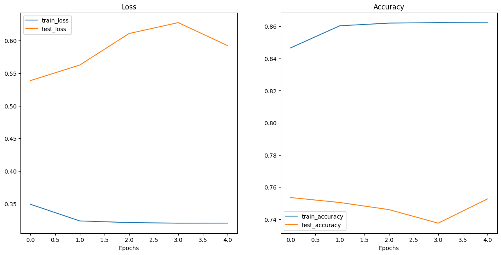

# DLP-Project

# Deepfake Detection using CNNs and Vision Transformers

This project implements **Convolutional Neural Networks (CNNs)** and a **Vision Transformer (ViT)** to detect deepfake images — a rising threat in the digital world where manipulated media can be used to spread misinformation or deceive people.

Made by:  

- Fahd Aleem (21k-3314)
- Abrar Shah (21k-4573)

---

## Why Detect Deepfakes in the First Place?

Deepfakes pose significant challenges:

- **Misinformation**: Easily weaponized for fake news, political manipulation, and social harm.
- **Psychological Impact**: Misuse can lead to loss of trust in digital content.
- **Cybersecurity Risk**: Can be used for impersonation or bypassing facial authentication.

This project aims to build robust models capable of identifying deepfakes reliably using image-based learning techniques.

---

## Dataset

We used a dataset comprising both **Real** and **Fake** face images divided into train, test and validation sets.  
**Link**: https://www.kaggle.com/datasets/manjilkarki/deepfake-and-real-images

- Total Images: [190,335]
- Deepfake Classes: [Real/Fake]
- Structure: Organized in folders per class — e.g., `Real/`, `Fake/`, etc.

---

## Data Preparation

The dataset was preprocessed as follows:

- **Resizing** (to 256x256 for CNNs and 224x224 ViT)
- **Normalization** (pixel values scaled to [0, 1] using `rescale=1./255`)
- **Batching**: Images were loaded in batches of 32 for efficient training.

The data was split into:

- **Training Set**: 140,002 images
- **Validation Set**: 39,428 images
- **Test Set**: 10,905 images

---

## CNN Models

In the first notebook, we implemented and compared the following CNN architectures:

1. **MesoNet** – A deepfake-specific architecture designed for facial forensics.  
   
2. **ResNet** – A classic residual network for deep learning stability. 
   
3. **DenseNet** – Known for efficient parameter use and dense connections.  
   

Each model was trained to classify inputs as either **real** or **fake**.

---

## Vision Transformer (ViT)

In the second notebook, we implemented:

- **ViT-B/16** from `torchvision.models` – A Transformer-based model that processes images as sequences of patches instead of convolutions.  
  

This model captures **global context** better than CNNs, making it suitable for subtle manipulations in deepfakes.

---

## Hyperparameters

| Parameter     | Value               |
| ------------- | ------------------- |
| Epochs        | 5                   |
| Batch Size    | 32                  |
| Learning Rate | 1e-4                |
| Optimizer     | Adam                |
| Loss Function | binary_crossentropy |
| Input Size    | 224x224             |

---

## Results

| Model    | Accuracy (%) | Computation Time |
| -------- | ------------ | ---------------- |
| MesoNet  | 83.92        | 4,740s           |
| ResNet   | 86.97        | 7,838s           |
| DenseNet | 67.99        | 1,996s           |
| ViT-B/16 | 86.22        | 2:34:07          |

---

## Conclusion

- This project implemented a reliable deepfake detection system using both CNNs and a Vision Transformer.
- ResNet achieved the highest accuracy due to its more complex architecture but required more computation time.
- ViT-B/16 also showed strong performance with very less training, indicating high potential for future use with extended training.

---
